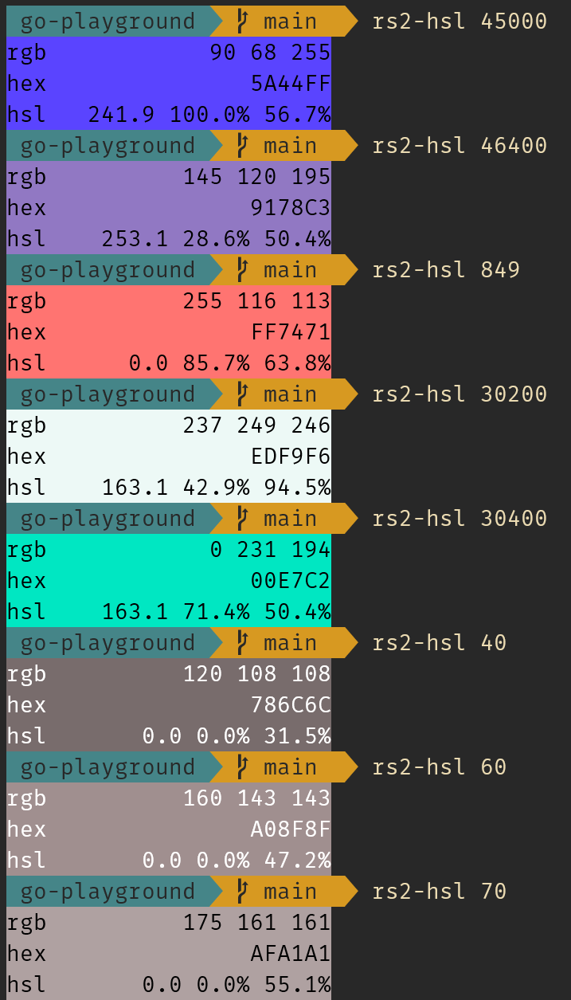

# RuneScape 2 HSL

RuneScape 2 uses a lookup table when rasterizing their triangles. This cli lets you feed it the indexes for that table and then it spits out that color along with 3 different representations of it.

# Installation
`go install github.com/thedaneeffect/rs2-hsl@latest`

# Usage
`rs2-hsl 43580`

# Preview

